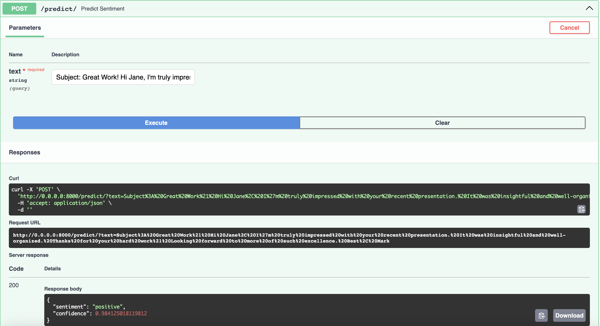
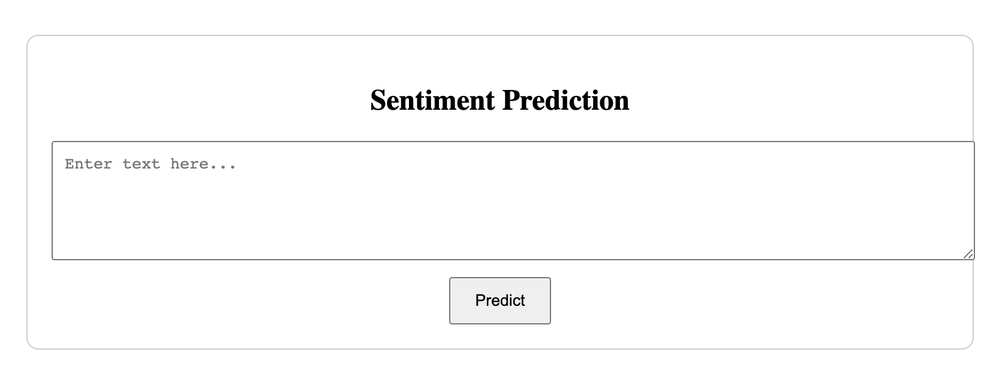

# Email Sentiment Analysis Project (Ongoing)

## Overview

This project aims to determine the sentiment of received emails and store the sentiment analysis results in a database per mail sender. The idea business goal behind it, it´s the company to be able to "track" how happy their customers are over the time and take actions through personalized mails. The project utilizes pre-trained language models, specifically leveraging the Hugging Face Transformers library, for sentiment analysis. The AWS cloud platform is used for model deployment and database storage. More detailed information of each step will be provided in the README of each folders.

## Project Structure

The project is structured as follows:

src/: Contains the information of the tokenizer and best model.

data/: Placeholder for storing the dataset. Information about the dataset can be found in the readme of the data folder.

scripts/: Scripts for model training, EDA and some tests with emails.

static/, templates/ : For editing the webpage.

## Steps to Reproduce

### Clone the repository

``` bash
https://github.com/santiagoorar/email-sentiment
```

### Setup Environment:

Set up the required Python environment with dependencies:

``` bash
pip install -r requirements.txt
```

### Open the app

``` bash
python app.py
```

### The webpage

For this, fast api was used. After adding an email, automatically it will give its sentiment.

At first, the webpage was set by default:



Then, the webpage was modified using html code:



## Deployment

After having the model, the dockerfile...

For the deployment a EC2 machine was created...


